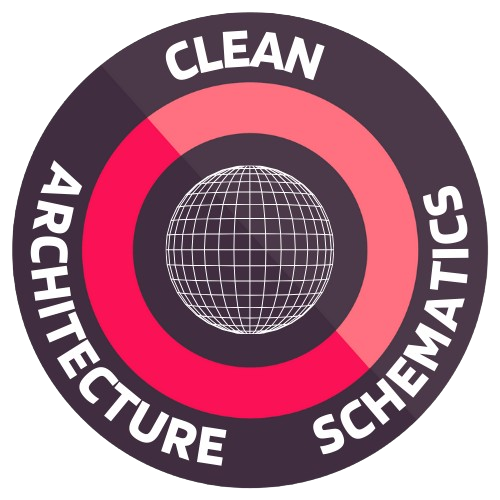

# Angular clean arquitecture schematics
vs code extension that serves to simplify the creation of view models and clean architecture templates in Angular.

[Link of the Vscode marketplace extension.](https://marketplace.visualstudio.com/items?itemName=Shunnior.bc-view-model-generator) 

## Features

Extension for Bancolombia developers to optimice the developer time of the SVP team by a faster way.

## Usage

First of all, it is used in Angular projects with the Jest testing library.

1. Position the cursor over the folder we want to use and press right click

2. Within the menu the "SVP schematics" option will be displayed, we will click on it

3. A list of actions willbe displayed, choose one of them and enjoy!

## How to deploy a new version?

1. Change the package version to the latest version  "version": "x.x.x",
2. Run vsce package command to create a new version file
3. Run vsce pucblish -p <token> to deploy the new version
